 

 

### `skills --whoami`

- Designs and ships production-grade backend systems in **Python** — `FastAPI`, `Django`, `DRF`
- Builds async, event-driven pipelines with `Celery` + `Redis`
- Owns infrastructure end to end — `AWS`, `Docker`, `CI/CD`, monitoring & alerting
- Designs auth layers, API contracts and microservice boundaries
- Ships frontend when a feature needs one owner — `React`, `Next.js`, `TypeScript`
- Comfortable across the full stack: schema → API → UI

 

### `stack --all`

**Backend**
 

**Data**
 

**Cloud & Ops**
 

**Frontend**
 

 

### `contact --secure`

  

